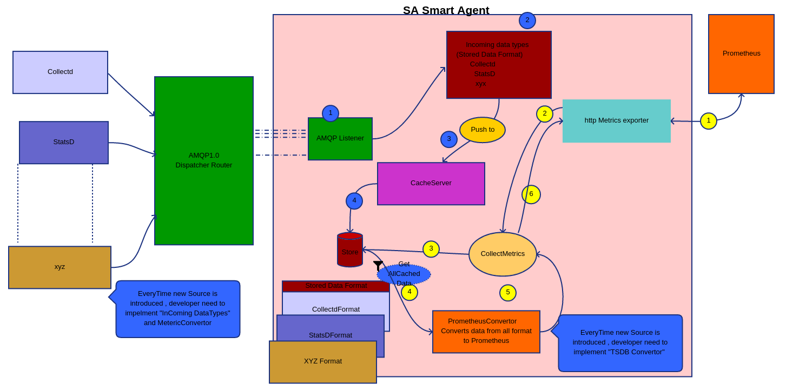

[](https://travis-ci.org/redhat-nfvpe/service-assurance-poc) [](https://goreportcard.com/report/github.com/redhat-nfvpe/service-assurance-poc)

## Note about development
- go to https://github.com/redhat-nfvpe/service-assurance-poc and fork it to
  your account
- Now in your environment run
  - `go get github.com/redhat-nfvpe/service-assurance-poc`
- and Navigate to the top level of the repository  service-assurance-poc
  ```
  cd to service-assurance-poc
  ```

- Rename the current origin remote to upstream
  - `git remote rename origin upstream https://github.com/yourname/service-assurance-poc.git`
- From here, the best approach would be to create a feature branch and work from there.
   ```
   git checkout -t -b new-feature
   // create new feature commits
   git add files
   git commit -m "message"
   git push origin new-feature
   ```
- Don’t forget to pull the changes from upstream before sending in a PR. This
  helps avoid merge conflicts.
  ```
  git fetch upstream
  git merge upstream/master
  ```

## Service Assurance Smart Agent POC
- Enabling Barometer with amqp1.0 plugin will write metrics to amqp1.0
  dispatcher.
- Running a SA-Smart Agent Service will start 3 services
    - qpid router listener, to consume all incoming collectd json
    - http server to expose metrics from collectd for Prometheus to scrape.
    - CacheServer to cache all incoming data from amqp1.0 plugin

### Requirements

- Install barometer, amqp1.0 dispatcher and Prometheus.



## Single node installation

### Barometer installation

**From Barometer User guide**:
Read barometer docker user guide [barometer docker user
guide](http://docs.opnfv.org/en/latest/submodules/barometer/docs/release/userguide/docker.userguide.html)

**Installing barometer collectd container WITHOUT AMQP plugin**
- $ git clone https://gerrit.opnfv.org/gerrit/barometer
- $ cd barometer/docker/barometer-collectd
- $ sudo docker build -t opnfv/barometer-collectd --build-arg http_proxy=`echo $http_proxy` \
  --build-arg https_proxy=`echo $https_proxy` -f Dockerfile .

**Installing barometer collectd container WITH AMQP plugin**

**Applying AMQP1.0 plugin patch to build docker images**

In order to apply AMQP1.0 plugin as patch for the docker image before building.
I copied the project to public github and made following changes to the project

For reference see below. You can skip this section to "Build with AMQP1.0
plugin"
- **Change 1 file: https://github.com/aneeshkp/barometer/blob/master/src/package-list.mk**
```
  +COLLECTD_AMQP1_PATCH_URL ?= https://github.com/collectd/collectd/pull/2618.patch
  +AMQP1_PATCH ?= 2619
```
**Collectd configuration**

```
LoadPlugin amqp1
<Plugin amqp1>
  <Transport "name">
    Host "10.19.110.5"
    Port "5672"
#    User "guest"
#    Password "guest"
     Address "collectd"
#    <Instance "log">
#        Format JSON
#        PreSettle false
#    </Instance>
     <Instance "notify">
        Format JSON
        PreSettle true
        Notify true
    </Instance>
    <Instance "telemetry">
        Format JSON
        PreSettle false
    </Instance>
  </Transport>
</Plugin>
```
- **Change2 file: https://github.com/aneeshkp/barometer/blob/f40a5bb86d77351f1cbe543fc08b75fc92ea4418/src/collectd/Makefile**
```
$(AT)sudo yum install -y qpid-proton-c-devel-0.18.2-1.el7.x86_64
```
- **Change 3 :https://github.com/aneeshkp/barometer/blob/master/docker/Dockerfile**
```

WORKDIR ${repos_dir}
RUN git clone https://github.com/aneeshkp/barometer.git
WORKDIR ${repos_dir}/barometer/systems
```

### Build with AMQP1.0 plugin
```
$ git clone https://github.com/aneeshkp/barometer.git
$ cd barometer/docker/barometer-collectd
$ sudo docker build --no-cache -t opnfv/barometer-collectd --build-arg http_proxy=`echo $http_proxy` \
  --build-arg https_proxy=`echo $https_proxy` -f Dockerfile .
```

### To Deploy Barometer container
```
docker run -tid --net=host -v `pwd`/collect_config:/opt/collectd/etc/collectd.conf.d  -v /var/run:/var/run -v /tmp:/tmp --privileged opnfv/barometer-collectd /run_collectd.sh
```
**Here `pwd`/collect_config contains all collectd configuration files. Enable and disable plugin under this directory**

### QPID Dispatcher installation (Read setting up standalone qpid-ansible read-me file. )
```
- git clone https://github.com/aneeshkp/qpid-ansible
- cd qpid-ansible
- change under hosts standalone server name
    [standalone]
    10.19.110.23
- ansible-playbook -i hosts main.yaml --tags config-standalone,router,start,status --limit standalone
```
### Prometheus Installation
Read Prometheus installation [Prometheus
installation](https://prometheus.io/docs/prometheus/latest/installation/) Set
the target in Prometheus yaml to scrap available metrics port (see Smart Agent
Usage for port).

### Service Assurance Smart Agent installation
```
git clone https://github.com/redhat-nfvpe/service-assurance-poc.git
Set go environment.
Follow error message to run "$go get dependencies"
```

### Smart Agent Usage
---
**Test : Running Benchmark**
- `go test -bench=.`

**For running EVENTS with AMQP  use following option.**
```
$go run events/main.go -amqp1EventURL=10.19.110.5:5672/collectd/notify -eshost=http://10.19.110.5:9200
```

**With configuration file.**
```
$go run events/main.go --config sa.event.congig.json

```

**For running METRICS with AMQP and Prometheus use following option.**
```
$go run metrics/main.go -mhost=localhost -mport=8081 -amqp1MetricURL=10.19.110.5:5672/collectd/telemetry
```

**With configuration file.**
```
$go run events/metrics.go --config sa.metrics.congig.json

```
---
**For running metrics with Sample data,  without AMQP use the following option.**

**Sample Data for metrics**

```
$go run metrics/main.go -mhost=localhost -mport=8081 -usesample=true -h=10 -p=100 -t=-1
```

```
--- Usage Details
  -config string
      Path to configuration file(optional).if provided ignores all command line options"
  -amqp1MetricURL string
    	AMQP1.0 listener example 127.0.0.1:5672/collectd/telemetry
  -count int
    	Stop after receiving this many messages in total(-1 forever) (OPTIONAL) (default -1)
  -h int
    	No of hosts : Sample hosts required (default 1). (default 1)
  -mhost string
    	Metrics url for Prometheus to export.  (default "localhost")
  -mport int
    	Metrics port for Prometheus to export (http://localhost:<port>/metrics)  (default 8081)
  -cpustats
      Include cpu usage info in http requests (degrades performance)
  -p int
    	No of plugins: Sample plugins per host(default 100). (default 100)
  -t int
    	No of times to run sample data (default 1) -1 for ever. (default 1)
  -usesample
    	Use sample data instead of amqp.This will not fetch any data from amqp (OPTIONAL)
